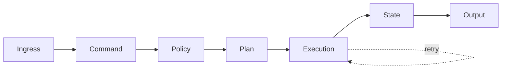

A durable workflow engine has one job: make a multi-step process survive crashes, restarts, and redeploys without losing its place. The hard part isn't the runtime — it's drawing a clean line between *what work means* and *how it runs*.

## The pipeline

A useful framing separates the request's journey into stages, each with a single responsibility:



Everything left of **Execution** is pure decision-making: validate the request, check policy, produce a plan. Everything right of it is effects and bookkeeping. Keeping these halves apart is what makes the system testable.

## Contracts, not implementations

The engine defines *contracts* — the shape of a command, a plan, a state transition — and lets a swappable runtime decide *how and when* steps actually execute.

```python
from dataclasses import dataclass
from typing import Protocol

@dataclass(frozen=True)
class Step:
    name: str
    payload: dict

class Runtime(Protocol):
    def enqueue(self, step: Step) -> str: ...
    def record(self, step_id: str, result: dict) -> None: ...

def plan(command: dict) -> list[Step]:
    # pure: same input -> same plan, no side effects
    return [Step("validate", command), Step("commit", command)]
```

Because `plan()` is pure, you can unit-test the decision logic without standing up a queue or a database.

## Durability comes from the log

Durability is not magic; it's an append-only record of intentions and outcomes. On restart, the engine replays the log to reconstruct state, then resumes from the first step without a recorded result.

| Property      | Mechanism                          |
|---------------|------------------------------------|
| At-least-once | retry on missing result            |
| Idempotency   | dedupe by step id                  |
| Recovery      | replay log, resume unfinished step |

> The runtime can be Temporal, a database-backed queue, or an in-memory stub in tests — the contracts don't change. That swappability is the whole point.
